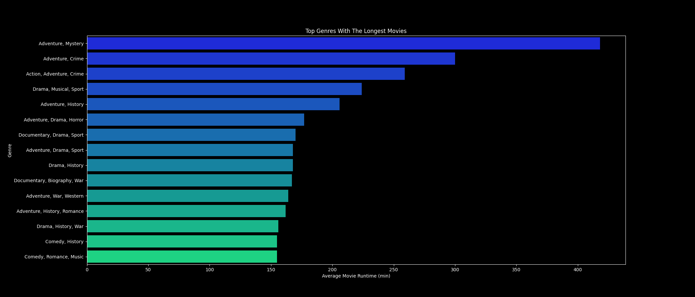

# IMDb Movie Rating Analysis
**Created by**:
Kajus Martynkinas, Arūnas Jusas

## Project Introduction
This project is designed to scrape movie data from IMDb using `ScrapingIMDb.py`, store it in a PostgreSQL database, and then analyze this data with `AnalysingData.py`,
which offers an interactive experience for generating various graphs based on user selection.

## Requirements
- Python 3.x
- Libraries: `bs4`, `pandas`, `requests`, `psycopg2`, `matplotlib`, `seaborn`
- PostgreSQL database

## Setup Instructions
1. **Database Setup**: Ensure you have PostgreSQL installed and create a database named `BdIMDb`.
2. **Python Environment Setup**: 
   - Install required Python libraries using `pip install -r requirements.txt`.
3. **Configure Database Connection**: 
   - In both `ScrapingIMDb.py` and `AnalysingData.py`, update the database connection parameters (`db_host`, `db_name`, `db_user`, `db_password`) to match your PostgreSQL setup.

## How to Run the Scripts
1. **Data Scraping**: Run `python ScrapingIMDb.py` to scrape movie data from IMDb and store it in the PostgreSQL database.
2. **Data Analysis**: Run `python AnalysingData.py` and follow the prompts to select and view different graphs based on the IMDb data analysis.

## Script Functionalities
- `ScrapingIMDb.py`: Scrapes IMDb data and stores it in a database. It checks and creates the necessary database table.
- `AnalysingData.py`: Connects to the database to fetch data and offers an interactive interface for users to select from various analysis tasks, displaying corresponding graphs and insights.

## Data Analysis Insights

In this analysis, we explored movie data from IMDb ([source](https://www.imdb.com/list/ls503325184/?st_dt=&mode=detail&page=1&ref_=ttls_vm_dtl&sort=list_order,asc)), focusing on 8 distinct tasks to uncover various trends and patterns in the film industry.

### Task 1: Top 5 Most Popular Genres
Our goal was to identify the most prevalent movie genres. The analysis revealed that "Drama" is the leading genre, accounting for over a thousand movies in the dataset.

### Task 2: Top 5 Most Popular Genres By Votes
This task aimed to determine which genres garnered the most audience engagement, measured by vote count. Consistently, the "Drama" genre emerged as the most interacted-with, potentially owing to its volume of movies.

### Task 3: Top 10 Movies By Rating
We analyzed the movies with the highest ratings. Topping the list is "Svet Koji Nestaje" with an impressive 9.5 rating.

### Task 4: Which Decade Released The Most Movies
This analysis aimed to identify the most prolific decade in terms of movie releases. The period from 2000 to 2009 led the way, with over 1200 movie releases.

### Task 5: Top Genres With The Longest Movies
Our focus here was to identify genres with the longest average runtime. The "Adventure, Mystery" genre typically features movies with the longest duration.

### Task 6: Voting Tendency By Rating
Investigating IMDb user behavior, we found that ratings predominantly fall between 7 and 8, indicating a general trend in user rating behavior.

### Task 7: Correlation Heatmap Between Movie Rating, Runtime, Release Year And Votes
This task explored potential correlations between a movie's rating, runtime, release year, and vote count. The analysis showed minimal correlation, with some noted between the number of votes and both the movie rating and release year.

### Task 8: Top Rated Genres By The Average Rating
Finally, we sought to find which genres receive the highest average ratings. The "Comedy, Family, Mystery" genre stands out with an average rating of 8.8.

## Additional Notes
- Ensure proper database accessibility and correct connection settings in the scripts.
- Adjust scraping parameters in `ScrapingIMDb.py` as needed for specific IMDb data.
- Modify `AnalysingData.py` to add or alter analysis tasks and visualizations.